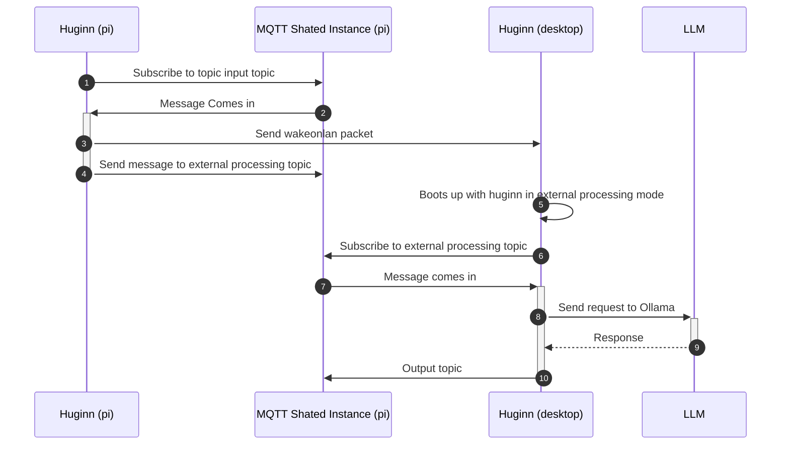

# huginn
A system service for language model management.

The goal of Huginn, is to be able to provide seemless language model interaction in a service that does not require the opening of another port on the machine, as well as the ability to select a more powerful machine to run a local model on or reach out to cloud models based on different strategies.

For example, I have a service that runs on a Raspberry PI that sometimes requires a call to an LLM, the PI does not have the resources to run a large model, however I have a desktop machine with an Nvidia GPU that is more than capable but is not always on, however it has wakeonlan enabled. 

Huggin, on receiving messages, should wake up the desktop machine using wakeonlan and then process the message on that machine by sending a request to the Ollama service running on that machine.



## How
Huginn receives messages on an MQTT topic, processes them, and publishes the results to another MQTT topic.
It takes in a message and a message id and returns a message and a message id.

The id is treated as a string in order to allow for the client to handle the message id as it sees fit, whether through compound keys or other methods.

The messages are sent as messagepack messages in the following format:

```c
typedef struct {
    char id[50];
    char message[200];
    char models[5][50];
    char strategy[50];
} Message;
```

The MQTT Instance should have 3 topics:

| Topic                     | Description                                                                     |
|---------------------------|---------------------------------------------------------------------------------|
| Input Topic               | The topic that Huginn will subscribe to for incoming messages                   |
| Output Topic              | The topic that Huginn will publish the results to and clients expect results on |
| External Processing Topic | The topic that Huginn will publish messages to for external processing          |

Since clients expect to read messages from the output topic, it does not matter whether the messages on there were posted by the
local Huginn instance or an external one.
